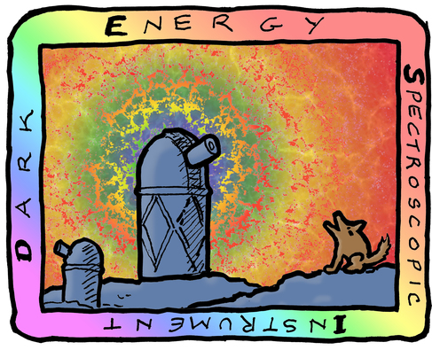

# Welcome to the DESI Survey Validation Data Assembly (SVDA)

The DESI Survey Validation Data Assembly (SVDA) is super cool and you should
definitely check it out.  This is a demo page of features we need for easy
documentation.

## Basics

mkdocs+Markdown supports basic features like *italics* and **bold**
and [external links](https://www.mkdocs.org).  It also supports links to
[other pages](about.md) in a nested hierarchy, and to specific subsections
of the current document (e.g. [code examples](#code-examples)) or
sections in [other documents](about.md#getting-started).

## Scope of SVDA

We definitely need bullet lists:

  * **SV1**: Deep observations spanning multiple nights of tiles designed
    with extra-broad target selection cuts for the purpose of generating
    truth tables and refining target selection choices.
  * **SV2**: a mini-survey "dress rehearsal" for starting SV3
  * **SV3**: near-final target selection observed with overlapping "rosettes"
    of tiles achieving nearly complete coverage of those targets in the
    covered areas of sky

And numbered lists too; interleaving with sub-bullets is a bonus

  1. we did this
    * blat
    * foo
  2. then that
  3. then some more
  
I didn't figure out how to do 2a, 2b... style number-then-letter sub-bullets.

## A table about SVDA

Here's what a table would look like

| Target class | SV1 | SV2 | SV3 |
| ------- | ---- | --- | --- |
| ELG     | many | a few | enormous |
| LRG     | lots | a few | even more |
| QSO     | 123  | 4 | 566 |
| RBG     | N/A  | N/A | N/A |
| BGS     | a bunch | ? | ! |
| MWS     | 1 | 2 | 3 |

## Code examples

Somewhere we'll have tutorial code, for which we'll want
inline code like `a = blat(foo)` and also fenced code blocks:

``` python
import numpy as np
from desispec.io import read_spectra
sp = read_spectra('spectra-0-1234.fits')
```

Note that little icon in the upper right of the code block:
that copies the code block to the clipboard ... a nice little feature.

## Search

Speaking of nice little features, see the "Search" bar in the upper right
of the page.  That searches across the entire site, and comes built-in
without any special config.

## Admonitions

Admonitions are inline colored notes, separated from the rest of the text.  They are a bit fancy, but potentially useful:

!!! note
    Don't get carried away with admonitions.  There should be more normal
    text than admonitions.
    
More text blah blat lorem ipsum etc.

!!! danger
    Beware of the ZWARN mask
    
You get the idea.

## Formulas

We can write LaTeX formulas inline $y = ax + b$ and also as separate blocks:
$$
m = \sum_i c_i \xi_i
$$


Another formula
$$
\gamma = \alpha + \beta
$$

!!! warning
    the mathjax config for rendering formulas is the most fragile piece
    I've found so far, and I needed some trial and error to get something
    working.  The default instructions resulted in formulas with unnecessary
    vertical scroll bars; this config requires block formulas to come
    immediately after a previous paragraph with no space, e.g.
    ```
    Another formula
    $$
    \gamma = \alpha + \beta
    $$
    ```
    but not
    ```
    Another formula

    $$
    \gamma = \alpha + \beta
    $$
    ```
    That's the biggest "gotcha" I've found so far with mkdocs.  I suspect
    that it can be fixed with a better config and isn't baked into the
    format rules, since other configs I tried didn't have that restriction
    but did have the extra vertical scroll bars.


## Pretty pictures

Inline pictures are easy to include:



## Project layout

    mkdocs.yml    # The configuration file.
    docs/
        index.md  # The documentation homepage.
        ...       # Other markdown pages, images, directories, etc.

## More info

See the [Getting Started](about.md#getting-started) section of the About page
for information about installing mkdocs and deploying the documentation.

See [mkdocs.org](https://mkdocs.org) for more details about mkdocs.

For more information about DESI, visit [desi.lbl.gov](https://desi.lbl.gov).
